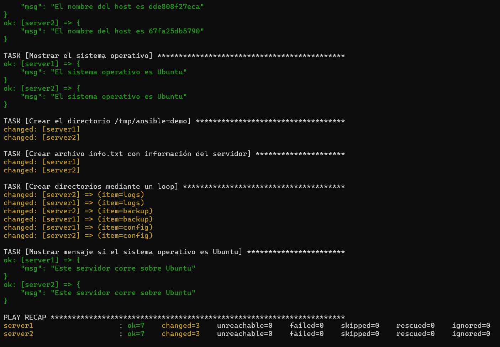

# Laboratorio de Automatización con Ansible

## Objetivo de la práctica
El objetivo de esta práctica es configurar un entorno automatizado utilizando Ansible para gestionar contenedores Docker. A través de este laboratorio, se busca:
- Gestionar la infraestructura como código.
- Automatizar tareas de configuración de sistemas operativos.
- Implementar la creación de directorios y archivos de forma masiva.

## Comandos para iniciar los contenedores
Para levantar el entorno de servidores (server1 y server2), utiliza el siguiente comando dentro de la carpeta `ansible-lab`:
ansible-playbook -i inventory.ini playbook.yml

## Resultado de la ejecución
A continuación se muestra la evidencia de la ejecución exitosa del playbook:

